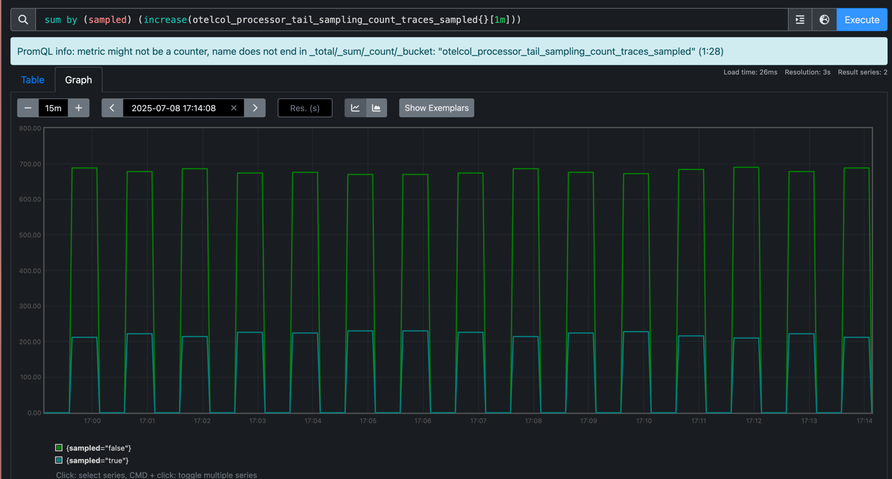

# GoodRX trace tail-sampling pipeline setup

## Install with [Just](https://github.com/casey/just)
```shell

# Setup and install all the components
just setup

# Create the telemetrygen cronjobs to run
just tracegen
```
## Checking sampling metrics in prometheus
The sampling decisions from the tail-based sampling processor are available with metrics in prometheus. Port-forward the prometheus
pod to a localhost port to access the prometheus instance. Then, using the metric from the screenshot below, you can see how many
traces were kept (sampled = true) or dropped (sampled = false).
